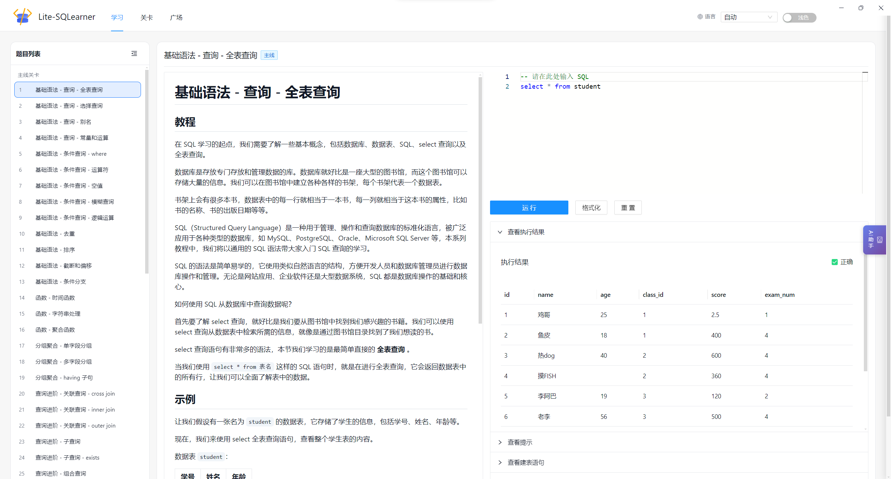
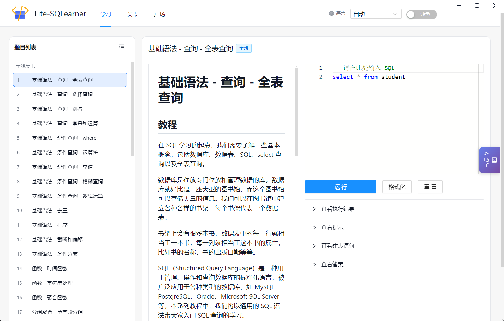
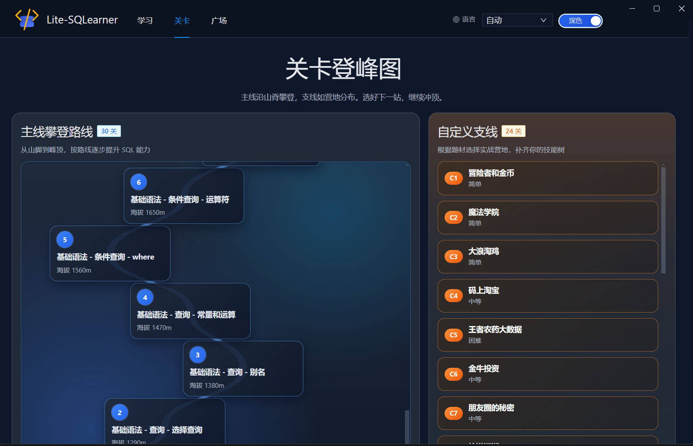
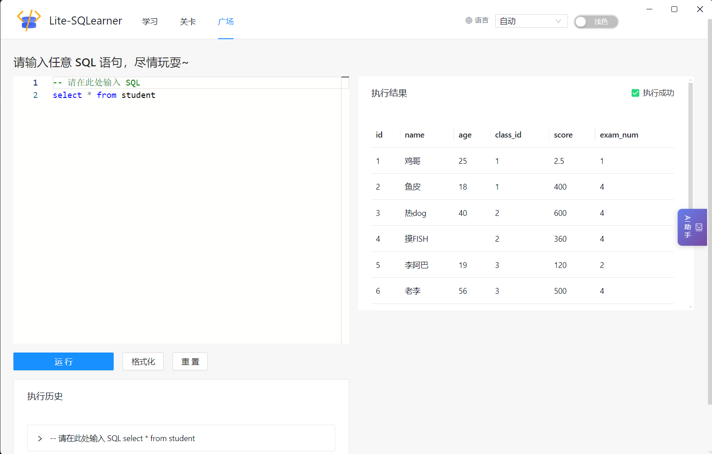

<p align="center">
  
</p>

<h1 align="center">Lite-SQLearner</h1>

<p align="center">
  一款交互式、游戏化的 SQL 学习桌面应用 —— 无需任何配置，即可在本地练习 SQL。
</p>

<p align="center">
  <a href="https://github.com/AperturePlus/lite-sqlearner/releases/latest">
    
  </a>
  <a href="https://github.com/AperturePlus/lite-sqlearner/actions/workflows/release.yml">
    
  </a>
  <a href="https://github.com/AperturePlus/lite-sqlearner/blob/main/LICENSE">
    
  </a>
</p>

<p align="center">
  <a href="../README.md">English</a> | <strong>中文</strong>
</p>

---

## ✨ 功能特性

- 🎯 **关卡挑战** — 从入门到进阶，循序渐进地完成结构化 SQL 关卡
- 📖 **内置教程** — 每个关卡均附有详细的 SQL 知识讲解
- 🏗️ **浏览器内 SQL 引擎** — 基于 [sql.js](https://github.com/sql-js/sql.js)（SQLite 编译为 WebAssembly），无需服务器
- ✅ **即时结果验证** — 编写查询、立即运行并获得反馈
- 🛠️ **SQL 练习场** — 自由探索模式，可以练习任意 SQL 查询
- 🤖 **AI 助手** — 集成 AI 对话侧边栏，支持 OpenAI、Anthropic 和 Google Gemini API
- 🎨 **深色 / 浅色主题** — 自由切换明暗显示模式
- 📦 **桌面应用** — 基于 Electron 构建，原生支持 Windows、macOS 和 Linux

## 📸 截图预览

<details>
<summary>点击查看截图</summary>

| 主页 | 浅色主题 |
|:----:|:--------:|
|  |  |

| 深色主题 | SQL 练习场 |
|:--------:|:----------:|
|  |  |

</details>

## 🛠️ 技术栈

| 层级 | 技术 |
|------|------|
| **框架** | Vue 3 + TypeScript |
| **桌面端** | Electron |
| **UI 组件** | Ant Design Vue |
| **代码编辑器** | Monaco Editor |
| **SQL 引擎** | sql.js（SQLite via WebAssembly）|
| **Markdown** | ByteMD |
| **状态管理** | Pinia（持久化状态）|
| **构建工具** | Vite |
| **AI 集成** | OpenAI / Anthropic / Google Generative AI SDK |

## 🚀 快速开始

### 环境要求

- [Node.js](https://nodejs.org/) >= 16
- [Yarn](https://yarnpkg.com/)（推荐）或 npm

### 开发模式

```bash
# 安装依赖
yarn install

# 启动 Web 开发服务器
yarn dev

# 以 Electron 开发模式启动
yarn dev:electron
```

### 打包构建

```bash
# 构建 Electron 应用（安装包将输出至 release/ 目录）
yarn electron:pack
```

打包完成的应用程序将输出到 `release/` 目录。

## 📁 项目结构

```
lite-sqlearner/
├── electron/          # Electron 主进程与预加载脚本
├── public/            # 静态资源（logo、WASM 二进制文件）
├── src/
│   ├── components/    # Vue 组件（编辑器、AI 侧边栏等）
│   ├── configs/       # 应用配置
│   ├── core/          # 核心逻辑（SQL 引擎、AI 提供商等）
│   ├── levels/        # SQL 关卡定义与教程
│   ├── pages/         # 页面视图（首页、关卡、练习场）
│   └── main.ts        # Vue 应用入口
├── doc/               # 截图资源
├── scripts/           # 构建辅助脚本
└── package.json
```

## 🤝 参与贡献

欢迎提交 Issue 或 Pull Request！

1. Fork 本仓库
2. 创建你的功能分支（`git checkout -b feature/amazing-feature`）
3. 提交你的更改（`git commit -m 'Add some amazing feature'`）
4. 推送到分支（`git push origin feature/amazing-feature`）
5. 发起 Pull Request

## 📄 开源协议

本项目为开源项目，详情请查看 [LICENSE](../LICENSE) 文件。
